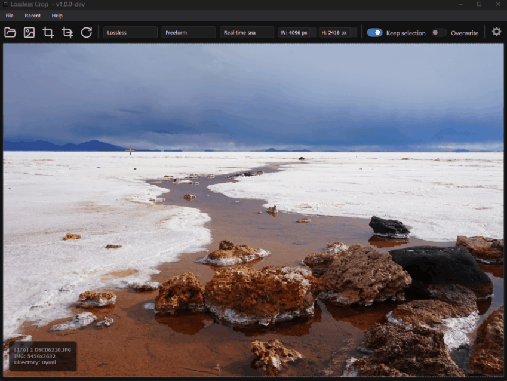

  

A cross-platform lossless image cropping application with many features and configuration options.

## Use case
Useful to quickly crop several images in a directory one after the other.

## Features

- Fast cropping workflow
- Floating configurable zoom preview
- Lossless cropping support for JPEG, PNG and BMP image format
- Lossy cropping support for JPEG and WebP format
- Exif data and ICC profiles conservation
- Crop area aspect ratio enforcing, conservation and re-sizing
- Crossplatform: Windows, Linux and macOS compatible
- Dark and Light Themes
- Global keyboard shorcuts
- Drag and drop support
- Recent directories menu
- Configurable user interface
- Optional settings persistence

## Demo

  

## Roadmap
- Internationalization
- Lossless resize
- Batch operations
