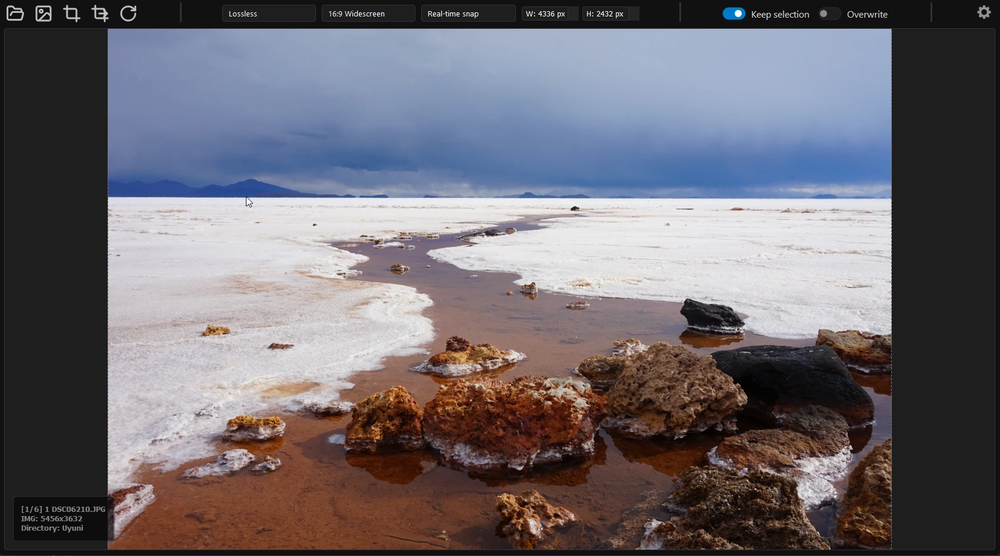
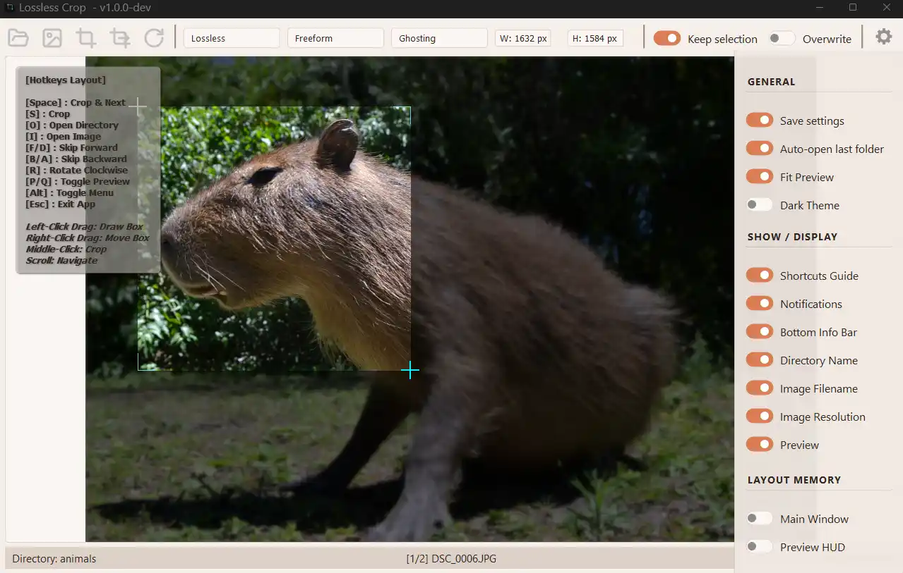
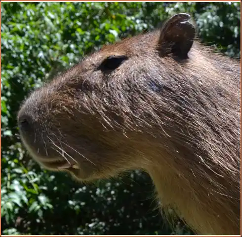

<p align="center">
  
</p>
<p align="center">


</p>
<p align="center">
  <a href="README.md"></a>
  <a href="docs/readmes/README.es.md"></a>
  <a href="docs/readmes/README.fr.md"></a>
  <a href="docs/readmes/README.pt.md"></a>
</p>

**A cross-platform lossless image cropping application with many features and configuration options.**

## Use case
Useful to quickly crop several images in a directory one after the other.

## Features

- Fast cropping workflow
- Floating configurable zoom preview
- **Lossless** cropping support for *JPEG*, *PNG* and *BMP* image format
- **Lossy** cropping support for *JPEG* and *WebP* format
- Exif data and ICC profiles conservation
- Crop area aspect ratio enforcing, conservation and re-sizing
- Crossplatform: **Windows**, **Linux** and **macOS** compatible
- Dark and Light Themes
- Global keyboard shorcuts
- Manual cropping area input
- Drag and drop support
- Recent directories menu
- Configurable user interface
- Optional settings persistence

## Demo
<p align="center">
  
</p>

## Supported Formats
- **JPEG**: Lossless or Lossy cropping modes
- **PNG**: Lossless 
- **BMP**: Lossless
- **WebP**: Lossy

## Installation

### Option 1: Binaries
Download the appropiate binary from the  [Releases Page](https://github.com/alejandronbachi/lossless-crop/releases)

 page:
- **Windows** (`LosslessCrop-Windows.exe`)
- **Linux** (`LosslessCrop-Linux`) and (`LosslessCrop-Linux.AppImage`)
- **macOS** (`LosslessCrop-macOS.tar.gz`)

[](https://github.com/alejandronbachi/lossless-crop/releases)

## Quick Start / Usage Guide
1. Open a directory with images 
2. Draw selection over the image
3. Press `space` to crop and move to the next image

## User Manual
Please read the [User Manual](/docs/user_manual.md) for more instructions, specially if you need to know how lossless cropping works, otherwise the selection area snapping could be an unexpected issue.

## Keyboard Global Shorcuts & Mouse Controls

| Keyboard Actions | Keys | Mouse Actions | Control |
| :--- | :--- | :--- | :--- |
| **Crop & Next** | <kbd>Space</kbd> | **Draw Box** | <kbd>Left-Click</kbd> + Drag |
| **Crop** | <kbd>S</kbd> or <kbd>Middle-Click</kbd> | **Move Box** | <kbd>Right-Click</kbd> + Drag |
| **Open Directory** | <kbd>O</kbd> | **Navigate** | <kbd>Scroll Wheel</kbd> |
| **Open Image** | <kbd>I</kbd> | **Crop** | <kbd>Middle-Click</kbd> |
| **Skip Forward** | <kbd>F</kbd> or <kbd>D</kbd> | | |
| **Skip Backward** | <kbd>B</kbd> or <kbd>A</kbd> | | |
| **Rotate Clockwise** | <kbd>R</kbd> | | |
| **Toggle Preview** | <kbd>P</kbd> or <kbd>Q</kbd> | | |
| **Toggle Menu** | <kbd>Alt</kbd> | | |
| **Exit App** | <kbd>Esc</kbd> | | |


## Showcase: light theme, commands, zoom hud, options and a capybara
  <br>
  <p align="center">
    
    
  </p>


## Development & Contributing
I'll be updating the documentation to make it easier to collaborate with the project soon, let me know if you are insterested in helping out.
The project was built with python with PyQt6 and Pillow libraries. I might be testing switching to Pyside6 shortly.
As im releasing as FOSS but also on the windows marketplace in an attempt to get some funding, collaborators will need to sign a cla, i will automate that shortly.

Prerequisites:
```
PyQt6==6.7.1
Pillow==10.4.0
```

## Roadmap
Depending on available time, application usage and user requests.
- Internationalization
- Lossless resize
- Batch operations

## License
This project is licensed under the GNU GPL 3 License - see the [LICENSE](LICENSE) file for details.

##  Support My Work

If you find this project useful, you can support its development via Binance Pay!

**My Binance Pay ID:** `1228818247`

*Scan the QR code below using your Binance Mobile App to donate instantly with 0% network gas fees (Supports USDT, BTC, ETH, and BNB).*


