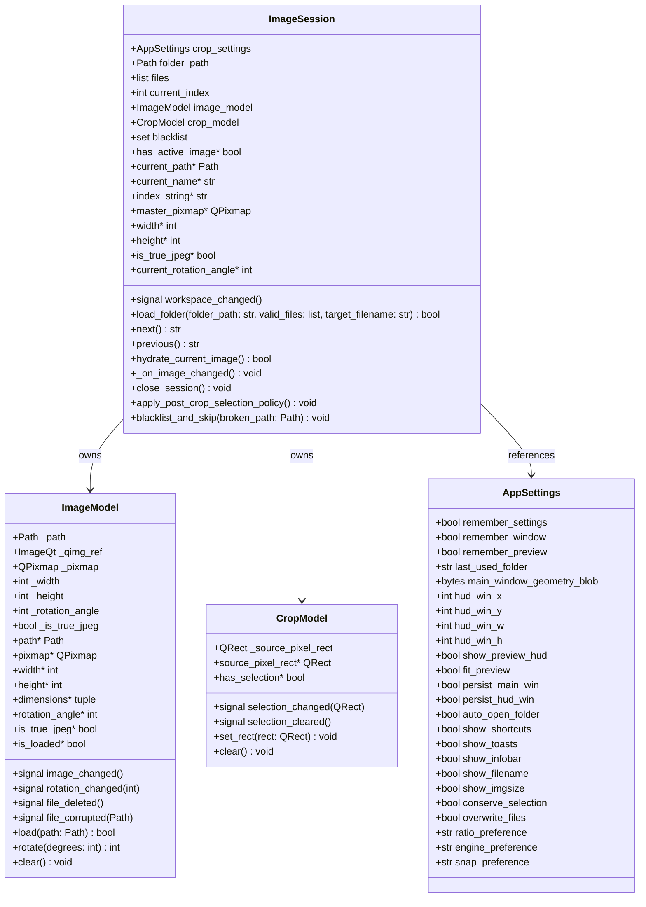

```mermaid
classDiagram
    class AppSettings {
        +bool remember_settings
        +bool remember_window
        +bool remember_preview
        +str last_used_folder
        +bytes main_window_geometry_blob
        +int hud_win_x
        +int hud_win_y
        +int hud_win_w
        +int hud_win_h
        +bool show_preview_hud
        +bool fit_preview
        +bool persist_main_win
        +bool persist_hud_win
        +bool auto_open_folder
        +bool show_shortcuts
        +bool show_toasts
        +bool show_infobar
        +bool show_filename
        +bool show_imgsize
        +bool conserve_selection
        +bool overwrite_files
        +str ratio_preference
        +str engine_preference
        +str snap_preference
    }

    class ImageModel {
        +Path _path
        +ImageQt _qimg_ref
        +QPixmap _pixmap
        +int _width
        +int _height
        +int _rotation_angle
        +bool _is_true_jpeg
        +signal image_changed()
        +signal rotation_changed(int)
        +signal file_deleted()
        +signal file_corrupted(Path)
        +path* Path
        +pixmap* QPixmap
        +width* int
        +height* int
        +dimensions* tuple
        +rotation_angle* int
        +is_true_jpeg* bool
        +is_loaded* bool
        +load(path: Path) bool
        +rotate(degrees: int) int
        +clear() void
    }

    class CropModel {
        +QRect _source_pixel_rect
        +signal selection_changed(QRect)
        +signal selection_cleared()
        +source_pixel_rect* QRect
        +has_selection* bool
        +set_rect(rect: QRect) void
        +clear() void
    }

    class ImageSession {
        +AppSettings crop_settings
        +Path folder_path
        +list files
        +int current_index
        +ImageModel image_model
        +CropModel crop_model
        +set blacklist
        +signal workspace_changed()
        +load_folder(folder_path: str, valid_files: list, target_filename: str) bool
        +next() str
        +previous() str
        +hydrate_current_image() bool
        +_on_image_changed() void
        +close_session() void
        +apply_post_crop_selection_policy() void
        +blacklist_and_skip(broken_path: Path) void
        +has_active_image* bool
        +current_path* Path
        +current_name* str
        +index_string* str
        +master_pixmap* QPixmap
        +width* int
        +height* int
        +is_true_jpeg* bool
        +current_rotation_angle* int
    }

    ImageSession --> ImageModel : owns
    ImageSession --> CropModel : owns
    ImageSession --> AppSettings : references
```
