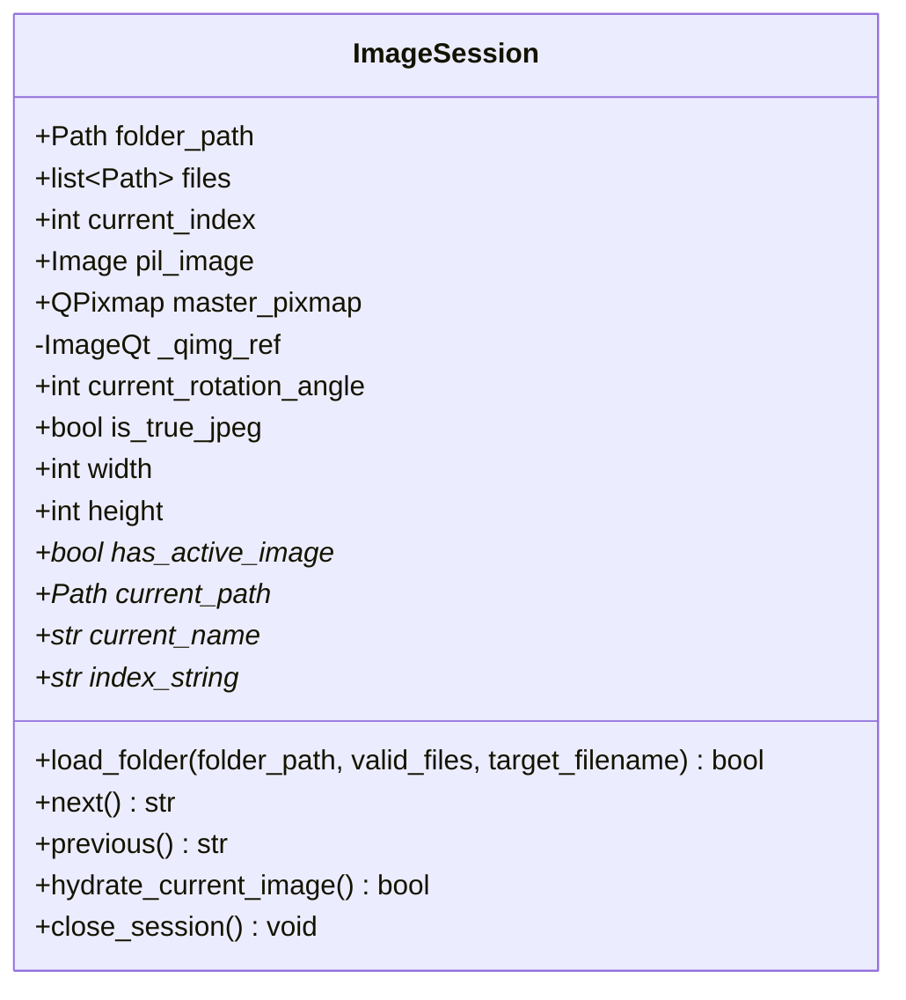

```mermaid
classDiagram


    class ImageSession {
        +Path folder_path
        +list~Path~ files
        +int current_index
        +Image pil_image
        +QPixmap master_pixmap
        -ImageQt _qimg_ref
        +int current_rotation_angle
        +bool is_true_jpeg
        +int width
        +int height
        +bool has_active_image*
        +Path current_path*
        +str current_name*
        +str index_string*
        +load_folder(folder_path, valid_files, target_filename) bool
        +next() str
        +previous() str
        +hydrate_current_image() bool
        +close_session() void
    }

 
```