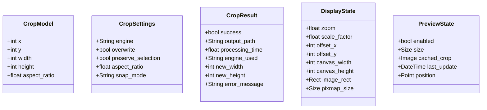

```mermaid
classDiagram

    class CropModel {
        +int x
        +int y
        +int width
        +int height
        +float aspect_ratio
    }

    class CropSettings {
        +String engine
        +bool overwrite
        +bool preserve_selection
        +float aspect_ratio
        +String snap_mode
    }

    class CropResult {
        +bool success
        +String output_path
        +float processing_time
        +String engine_used
        +int new_width
        +int new_height
        +String error_message
    }

    class DisplayState {
        +float zoom
        +float scale_factor
        +int offset_x
        +int offset_y
        +int canvas_width
        +int canvas_height
        +Rect image_rect
        +Size pixmap_size
    }

    class PreviewState {
        +bool enabled
        +Size size
        +Image cached_crop
        +DateTime last_update
        +Point position
    }
```